# Network Programming “MUST Meeting-Application”Report ——<MARK>Text Transmission IS ANYTHING</MARK>

**Group Member**: **SILAN HU | YI REN | HAOTONG SHI**

**Finnish Time: 22/12/2023**

---

[TOC]

## 0. Abstract && Background

This report describes the project we developed based on what we learned about web programming, which outlines the use of web programming in creating multifaceted web applications, **including chat,  white-boarding, and voice calling capabilities.** The impetus behind this idea stems from the growing demand for efficient and versatile integrated communication tools. 

We dared to envision and create a communication tool that pushes the boundaries of TCP and UDP technologies, drawing inspiration from and aspiring to surpass platforms like WeChat and QQ. This report is not just a collection of technical achievements; it's a saga of innovation, perseverance, and the sheer wonder of transforming complex concepts into tangible, user-centric solutions.

- **Practical exploration beyond the classroom**
  During the actual development process, **we deeply realized the core position of text transmission in modern network applications**. Based on this principle, we successfully implemented all key functions of the project. We don't just stay at the theoretical level, but continue to explore and make breakthroughs through practice.

- **Technology implementation and innovation**
  - From the construction of the server to the modular implementation of functions, we used **Python and C language** to build the application infrastructure. In addition,
  - In order to improve the user experience, we developed an attractive user interface using the **PyQt5 framework**. 
  - Our UI design is not limited to basic functions, but also includes special functions such as **theme switching and log archiving**. Innovations in these details reflect the practicality and aesthetics of our projects

## 1.Contribution of every member in detail 

- **Hu Silan**: Database design and implementation, server-side development, API development, data fetching and storage, user authentication and authorization, testing and debugging, backend/frontend integration, and documentation. 

- **Ren Yi**: testing and debugging, backend/frontend integration, PPT writing and documentation. 

- **Shi Haotong**: testing and debugging, backend/frontend integration, PPT writing and documentation.  

## 2. Project Overview ,Design&& Challenges ——Text Transmission IS ANYTHING

### 2.1 Meeting Room vs. Chatting Room: Unique Function Points in Our Application

In the context of our project, the differentiation between Meeting Rooms and Chatting Rooms is crucial, each designed to serve specific communication needs influenced by our deep understanding of network programming.

#### Meeting Room:

- **Complex Communication Tools:** Our Meeting Room is not just a chat space; it's a comprehensive communication platform. Here, users can utilize the advanced features we developed, such as real-time whiteboarding and voice calls, essential for collaborative and formal meetings.
- **Real-Time Whiteboard:** A highlight of our Meeting Room is the interactive whiteboard. This feature, developed from our insights into text transmission, allows participants to collaborate visually, sharing ideas and information in a dynamic and engaging manner.
- **Voice Communication Integration:** Reflecting our project's focus on efficient data handling, the voice communication in Meeting Rooms is designed for clarity and low latency. This feature is crucial for discussions that require more nuance than text can provide.
- **Enhanced User Interaction:** Our Meeting Room supports file sharing and interactive tools, making it a versatile platform for various professional settings. This aligns with our project’s goal to provide a multifunctional and user-friendly experience.

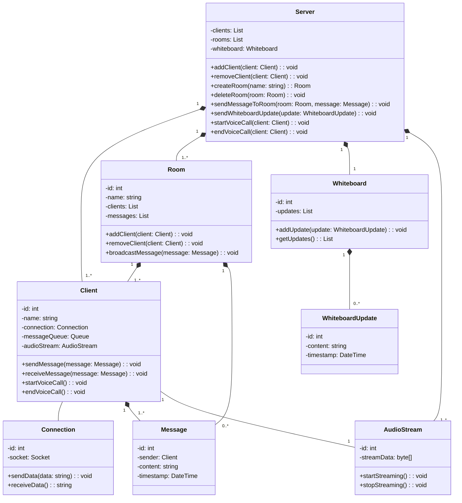

In our application, the Meeting Room and Chatting Room are distinct yet complementary components. The Meeting Room is tailored for structured, multi-faceted communication, while the Chatting Room excels in facilitating informal, day-to-day interactions. This dichotomy showcases our project's versatility and our commitment to addressing a broad spectrum of communication needs.

**Based on its complex functions, step-by-step completion is the best choice**


### 2.2. Methodology and Each Stage——The Core Idea: <MARK>Text Transmission IS ANYTHING</MARK>

> At the heart of our project lies a simple yet profound realization: <mark>**text transmission is everything.** </mark>
>
> Flowing Gantt chart demonstrates the whole progress as we developed the project.  

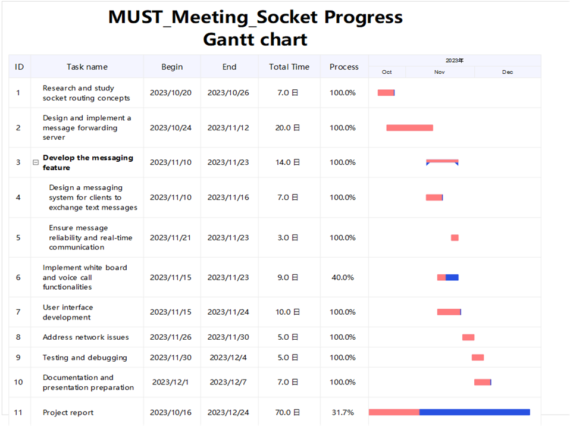

- **Building the Web Server**:

  > In addressing the challenge of message forwarding in Wide Area Networks (WAN), our initial step was to conduct a preliminary experiment. We developed a web server in C language, focusing on foundational features essential for a robust server. This server is capable of handling multiple client connection requests concurrently. It parses HTTP requests, facilitating the retrieval and transfer of files. Key to its operation is the ability to log client access information, which is crucial for tracking and analyzing usage patterns.

  To ensure stability and efficiency, we implemented multi-threading, allowing the server to manage multiple requests simultaneously without performance degradation. Additionally, mutex locks are employed to prevent data races and ensure thread safety, a critical aspect for maintaining data integrity and consistent server response.

- **Use Socket-IO to Release Multi-Person Chat**:

  > For the multi-person chat feature, we leveraged FLask-Socket-IO, a powerful Python library that enables real-time, bidirectional, and event-based communication. This choice was driven by Flask-Socket-IO's ability to handle multiple simultaneous connections with ease, a necessity for any chat application.

  The implementation involved setting up a chat server that manages user connections and broadcasts messages. Users can join various chat rooms, and messages sent in a room are received by all connected users in real-time. Flask-Socket-IO's efficient handling of websockets underpins the application’s ability to provide a seamless and responsive chat experience, even under the load of multiple users.

- **Whiteboard Feature Development**:

  > The whiteboard feature required a different approach, focusing on real-time collaboration and interactivity. We developed a system where users can draw, annotate, and share ideas on a digital canvas. This required capturing drawing inputs, such as strokes and shapes, and translating them into data that can be shared and rendered across different clients.

  Our solution was to create a drawing protocol, which converts drawing actions into a series of commands. These commands are then sent to other clients through the server, where they are reconstructed into the original drawing. This method ensures that all participants see the same content on the whiteboard in real-time, enabling effective collaboration.

- **Voice Communication Realization**:

  > The voice communication component presented a unique challenge, particularly in handling real-time audio streaming with low latency. We developed a system where voice data is captured, encoded into a digital format, and then transmitted over the network.

  This process involves capturing audio input from a user's microphone, compressing it to reduce size and bandwidth usage, and then sending it to the server. The server then relays this audio data to other clients, where it is decompressed and played back in real-time. Special attention was given to the selection of audio codecs and compression techniques to ensure clear and uninterrupted voice communication.

This realization became our guiding star, leading us through the complexities of network programming. We discovered that whether it's a whiteboard application or voice transmission, the key lies in converting information into text-like formats, making it the universal language of our application.（We have fully implemented a Web server, the interface design of the MUST Meeting Room program, the multi-person chat room and whiteboard functions.）

## 3 Stage 1: Building the Web Server

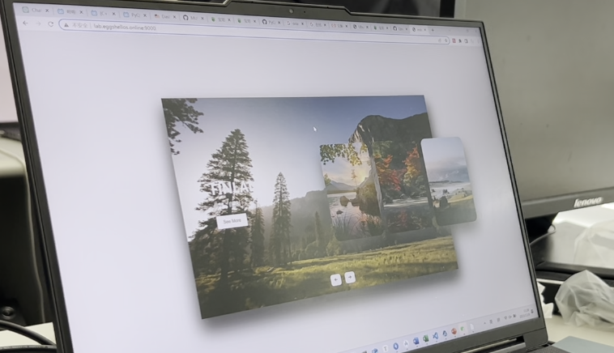

> - **Challenge:** Establishing a robust server capable of handling multiple client requests simultaneously.
> - **Breakthrough:** Utilizing text protocols for efficient data handling, ensuring seamless communication between server and clients.

### 3.1 text transmission is everything: WEB-Pages is a kind of text transmission

The realization that text transmission is at the heart of web communication was a pivotal moment in our project. Web pages, fundamentally, are a sophisticated form of text transmission. Each webpage is a structured text document, interpreted and rendered by web browsers. This understanding led us to focus on the efficiency and reliability of our text transmission protocols.


Our server, built in C language, demonstrates this concept. It handles HTTP requests, a standard text-based protocol for web communications. By parsing these requests, our server can understand and fulfill client demands, whether it's serving a webpage or handling a file request. 


In the code of the web server written, its core function is that when the file is successfully found, the server will return a response. The content of this response includes the status code and its description text, which is used to indicate the processing result of the request. . Next, the server returns an HTML-formatted text as the body part of the response, containing the content of the file requested by the client. In addition, the server can also return other types of resources, such as CSS files and JavaScript files, which are important components for defining the style and interactive functionality of web pages.


We found that this server can be implemented using socket programming method. The server can process the client's HTTP request and return the corresponding resources according to the request, such as HTML text, CSS style sheet or other files. This text-based transmission and processing is the basis of Web communication. Through this, we can also have a deeper understanding of the working principle of Web communication and the process of data transmission.


This emphasis on text transmission ensures that our web server is not just functional but also efficient and scalable, capable of handling multiple simultaneous client connections seamlessly.

### 3.2 Review of HTTP SEVER and Socket progress

> Following sequence diagram shows the process of processing http requests between the server and the client after going through a three-way handshake to establish a TCP connection:

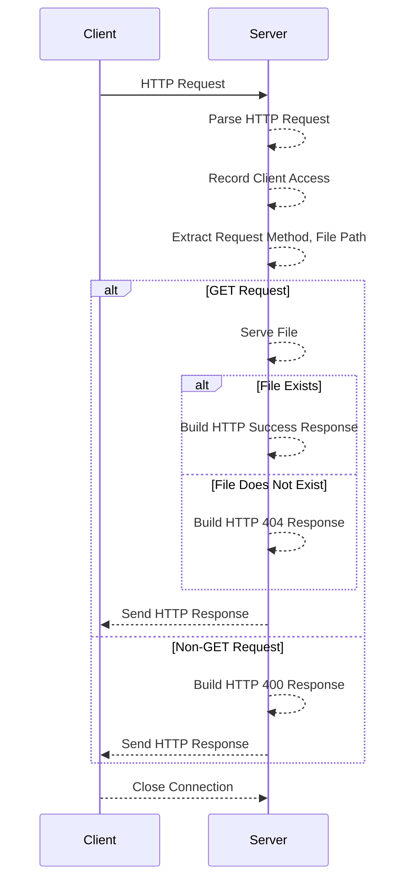


### 3.3 Our Key Steps with Codes

- **Accept the request** - After the Client sends the request, the Server uses the 'read' function to read the HTTP request content from the client's socket. This step reads the request content into a buffer in the server's memory.

```c
char request[2048];
read(clnt_sock, request, sizeof(request)-1);
```

- **Parse the request header** - We use the `get_header_field` function to parse the HTTP request header and extract key information, such as request method, request path, Host field, etc. In the code, we mainly extract the Host and User-Agent fields.

```c
char* host = get_header_field(request,"Host");
char* user_agent = get_header_field(request,"User-Agent");
```

- **Record client access information** - We use the `record_client_access` function to record client access information, including client IP address, visited Host, User-Agent information, etc. This information can be used for purposes such as statistics on visits.

```c
record_client_access(cint_ip, host?host:"Unknown", user_agent?user_agent:"Unknown");
```

- **Handle request method** - We use the `strtok` function to parse the request method and request path in the HTTP request. Next, determine whether it is a GET request. If it is a GET request, call the `serve_file` function. If not, a response will be returned. `HTTP/1.1 400 BAD REQUEST` represents the HTTP version, status code and text description. `text/html` represents the response body is text in HTML format. `Connection: close` represents that the connection will be in Closed after the request/response is completed. Finally, the length of the message body, telling the receiver how many bytes of data should be received.

  ```c
  char *method = strtok(request," ");
  char *filepath = strtok(NULL," ");
  
  if (method && filepath && strcmp(method,"GET") == 0)
      serve_file(clnt_sock,filepath);
  else {
  	char response[] = "HTTP/1.1 400 BAD REQUEST\r\n"
          			  "Content-Type: text/html\r\n"
          			  "Connection: close r\n"
          			  "Content-Length: 11\r\n\r\n”
          			  "Bad Request";
  	write(clnt_sock, response, sizeof(response) - 1);
  }
  ```

  **If the requested path is the root path ("/")**, first attempts to serve the default index file (for example, "index.html"). This approach helps improve user experience and simplifies URL processing on the client side. If the index file exists, `serve_file` is called recursively to provide the contents of the index file. If the index file does not exist, `server_directory` will be called to provide the directory listing. If it is not the root path, it will be opened using the open function. If the file does not exist, an `HTTP 404 NOT FOUND` response will be returned. If it exists, the file size information will be returned.

  ```c
  if (strcmp(filepath, "/") == 0) {
          char index_path[512];
          snprintf(index_path, sizeof(index_path), "%s/index.html", ROOT_DIR);
          if (access(index_path, F_OK) != -1) {
              serve_file(sock, "/index.html");
              return;
          } else {
              serve_directory(sock, ROOT_DIR);
              return;
          }
      }
  ```

  ```c
  int fd = open(path, O_RDONLY);
  if (fd == -1) {
      snprintf(response, sizeof(response),
               "HTTP/1.1 404 NOT FOUND\r\n"
               "Content-Type: text/html\r\n"
               "Content-Length: 9\r\n\r\n"
               "Not Found");
      write(sock, response, strlen(response));
      return;
  }
  
  struct stat st;
  stat(path, &st);
  int file_size = st.st_size;
  snprintf(response, sizeof(response),
           "HTTP/1.1 200 OK\r\n"
           "Content-Length: %d\r\n\r\n", file_size);
  write(sock, response, strlen(response));
  
  char buffer[1024];
  int bytes_read;
  while ((bytes_read = read(fd, buffer, sizeof(buffer))) > 0) {
      write(sock, buffer, bytes_read);
  }
  close(fd);
  ```

 

## 4 Stage 2:  Use Socket-IO releaze Multi-Person Chat

> - **Challenge:** Establishing a robust server capable of handling multiple client requests simultaneously.
> - **Breakthrough:** Utilizing text protocols for efficient data handling, ensuring seamless communication between server and clients.

### 4.1 text transmission is everything: Room-ID is a kind of text transmission

In our chat application, the concept of text transmission takes a unique form through the use of Room-IDs. A Room-ID is a text-based identifier that distinguishes one chat room from another. This simple yet effective approach allows us to manage multiple chat rooms efficiently.

Our entity-relationship diagram highlights the relationship between users, rooms, and messages. The Room-ID serves as a key element in this relationship, linking users to specific chat rooms and their associated messages. By transmitting these IDs as text, we efficiently direct messages to the correct rooms, ensuring that our chat application can support multiple, simultaneous conversations without confusion or overlap.

### 4.2 Entity Relationships and Database Design 

> - **User and Room are related through UserRoom**, which means that users can participate in multiple rooms. 
>
> - **User and Message are connected through the "sends" relationship**, which means that the user can send multiple messages. 
>
> - **Room and Message are connected through the "contains" relationship**, which means that a room can contain multiple messages. 
>
> - **Room and Meeting are connected through the "hosts" relationship**, which means that one room can host multiple meetings. 
>
> - **Users are related through Friendship**, which means that users can establish friendship relationships.

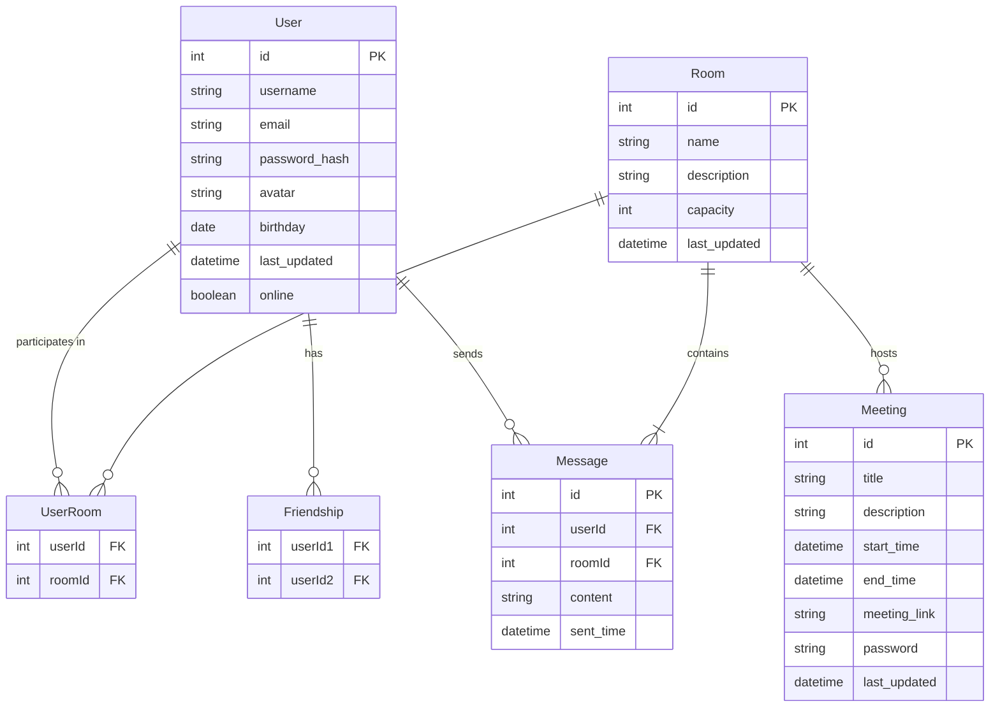

- **User:** This entity contains the user's basic information, such as username, email, password hash (for security reasons, the hash value is stored instead of the clear text password), avatar, birthday, last update time, and online status.

- **Room:** Represents a chat room, including ID, name, description, capacity and last update time.
- **Meeting:** Associated with Room, representing a meeting entity, including meeting details such as ID, title, description, start time, end time, meeting link and password, and last update time.
- **Message:** Stores messages sent by users in the room, including message ID, sender ID, room ID, message content and sending time.
- **UserRoom:** is an association table that displays the many-to-many relationship between users and rooms. A user can participate in multiple rooms, and a room can have multiple users.
- **Friendship:** Another association table that indicates a two-way relationship between users. There are two user IDs per relationship.

## 5. Stage 3: Whiteboard Feature Development

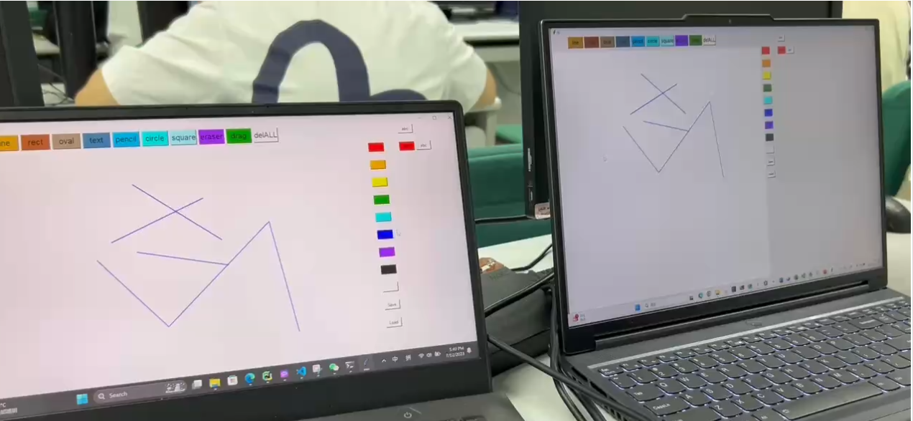

> - **Challenge:** Creating a real-time collaborative whiteboard without overwhelming bandwidth.
> - **Innovation:** Transmitting key points and styles instead of the entire drawing, dramatically reducing data load while maintaining functionality.

### 5.1 text transmission is everything: Graphic-drawing is a kind of text transmission

> The development of the whiteboard feature introduced a new dimension to our understanding of text transmission. Instead of transmitting heavy graphical data, we innovated by converting drawings into a series of text-based instructions.

This approach dramatically reduces the data load. When a user draws on the whiteboard, the application generates a set of instructions describing the drawing, such as start and end points, color, and thickness. These instructions are then sent as text to other clients, where they are reconstructed into the original drawing. This method is both bandwidth-efficient and ensures real-time collaboration, as evidenced by the flowchart and component diagram in our report.


For instance, 

### 5.1.2 Image Update

**Components in the drawing application:**

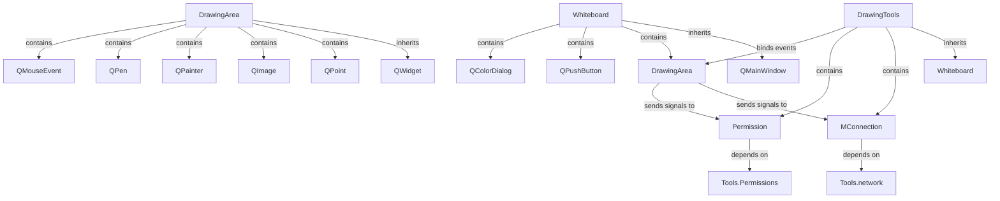

`DrawingArea` This class contains multiple components and is a custom widget that provides a drawing interface and allows color selection. `Whiteboard` contains buttons and functions for selecting colors. 

`DrawingTools` is used to manage communication between drawing tools and other components. `MConnection` depends on `Tools.network`, indicating that it handles network-related tasks for transferring data between different parts of the application.

**Image Update base on socket**:


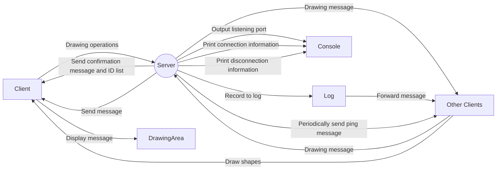

The client performs drawing operations in the drawing area, such as drawing lines, shapes, etc. Operations during the drawing process are sent to the server. The drawing messages sent by the client will be received by the server and broadcast to all other clients to achieve drawing synchronization among multiple users. After the server receives the drawing message, it logs it and forwards the message to all other clients. After receiving the drawing message, the client draws on its own drawing area and maintains synchronization with the drawings of other clients.

 

## 6. Stage 4: Voice Communication Realisation

> - **Challenge:** Implementing a reliable and efficient online voice communication system.
> - **Solution:** Converting voice signals into binary sequences, allowing us to transmit voice as a series of text-based messages.

### 6.1 text transmission is everything

> The final frontier of our project was incorporating voice communication, where we again applied our principle of text transmission. We converted voice signals into binary sequences, essentially turning them into a form of text that can be transmitted over the network.

This method involved capturing audio, compressing it into a binary format, and then transmitting these binary sequences as text-based data packets. On the receiving end, these packets are converted back into audio signals. Our flowchart outlines this process, showing the steps from audio capture to transmission and reception.


By treating voice as a form of text transmission, we were able to incorporate efficient, real-time voice communication into our application, overcoming the challenges typically associated with streaming audio over the internet.


### 6.2 **Flowing flowchart describes our design of the process of audio streaming communication between a client and a server:**

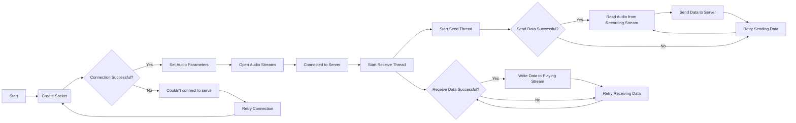

- **Create a socket**: The client attempts to create a network socket, which is the basis for network communication.

- **Check whether the connection is successful:**

  -  If the connection is successful, the process continues to set the audio parameters.
  -  If the connection is unsuccessful, the message "Couldn't connect to server" is output, and then the connection is retried.

- **Open the audio stream:** Once the connection is successful and the audio parameters are set, the client will try to open the audio stream.

- **Start the sending and receiving threads:**

  - Sending thread: Responsible for reading audio data from the recording stream and sending it to the server.

  - If the data is sent successfully, continue to send data in a loop.

  - If sending data fails, try to resend the data.

- **Receiving thread: Responsible for receiving data from the server and writing it to the playback stream.**

  - If the data is received successfully, continue to receive data in a loop.

  - If receiving data fails, try to receive data again.


## 7. Project File

**You can get exposure to whole project base on the link of my git-hub repository:**

> https://github.com/Qingbolan/MUSTmeetingSocke

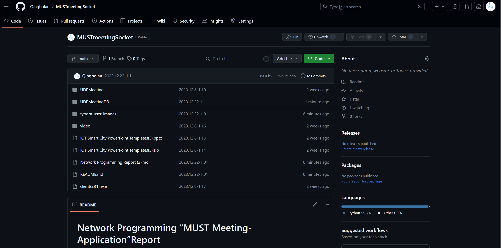

### 7.1 Recount of the Entire Project

#### 7.1.1 **launch**

- **client**

  ```bash
  python -u "UDPMeeting\MUST_UDPmeeting.py"
  ```

- **sever**

  ```c
  python -u "UDPMeetingDB\main.py"
  ```

#### 7.1.2 Usages

> Login with user Name and password

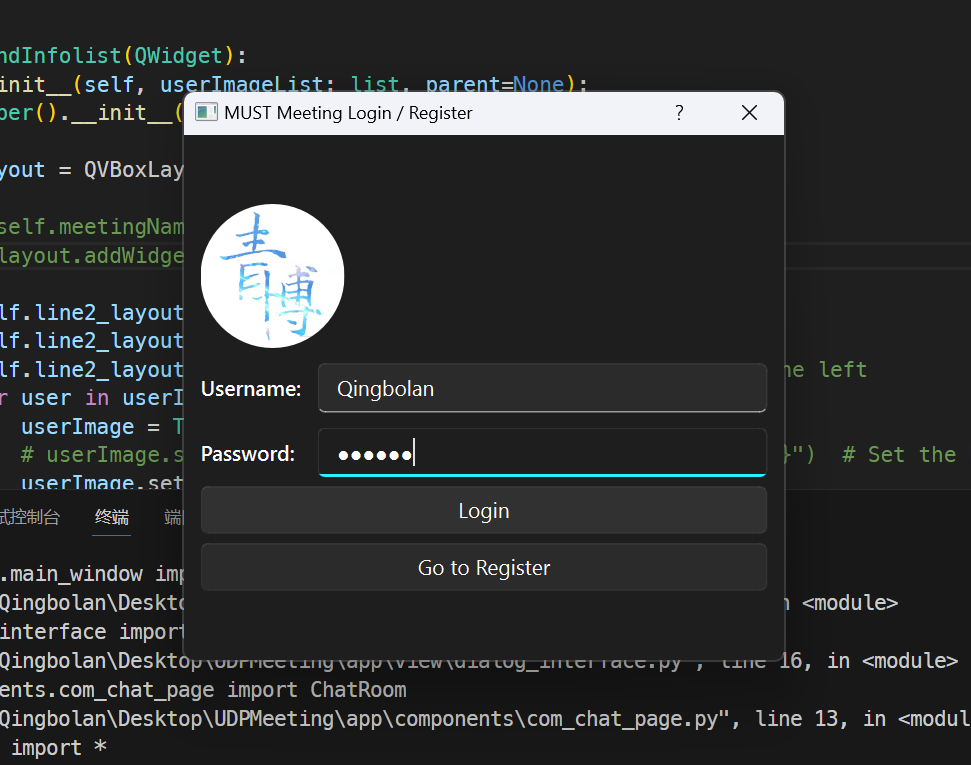

> do some UI settings

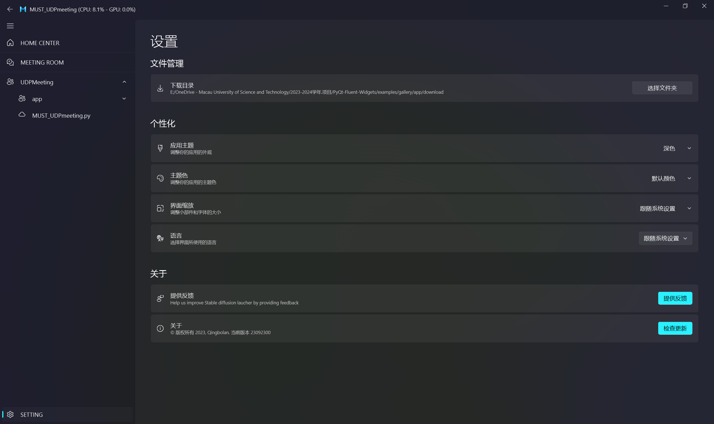

> select your chat,click and enter(black theme on the left;white theme on the right)

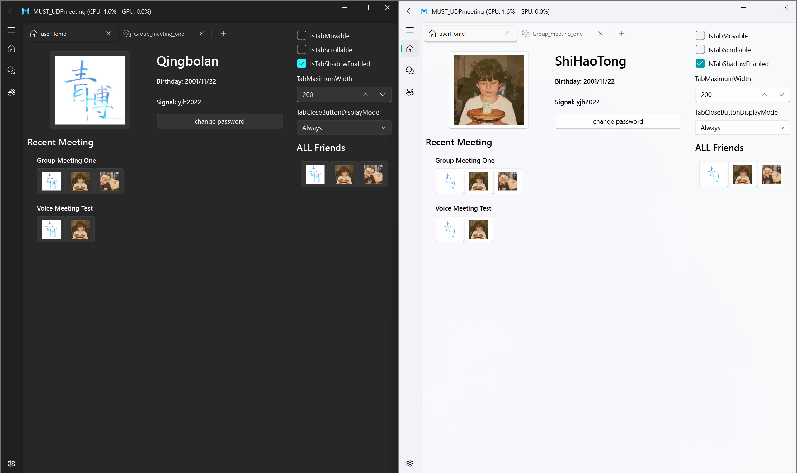

> Input your message and chat with each other(black theme on the left;white theme on the right)

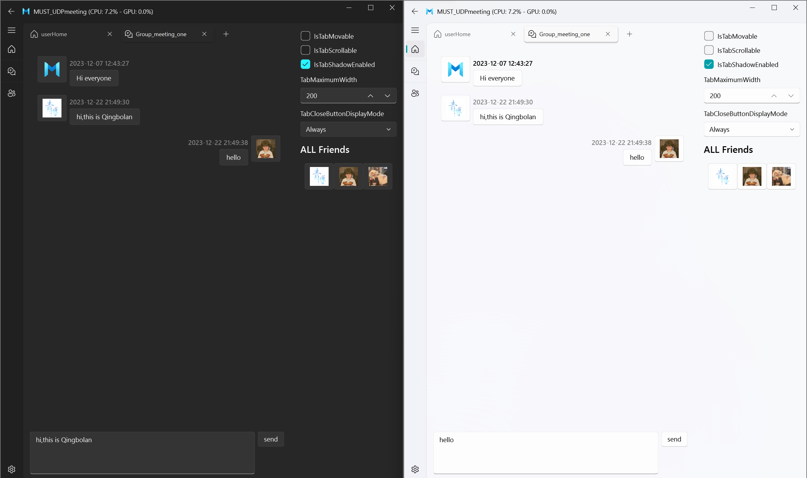

> enter the meeting room and draw something.. 

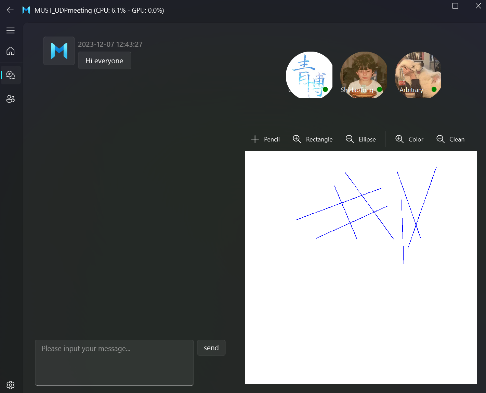

### 7.2 Recount of Web-Socket-Server

#### 7.2.1 **launch**

- **sever**

  ```c
  cd UDPMeetingDB\demo\component-servers\HTTP-socketServer
  gcc sever.c -o server
  server [your Port]
  ```

#### 7.2.2 Usages

> use your browser with localhost:[your Port]

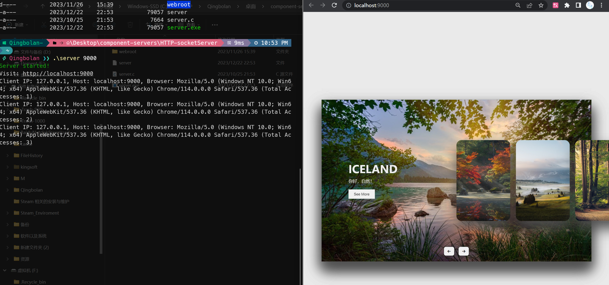

### 7.3 Recount of White Board

#### 7.2.1 **launch**

- **client**

  ```bash
  python -u "UDPMeeting\MUST_UDPmeeting.py"
  ```

- **sever**

  ```c
  python -u "UDPMeetingDB\demo\component-servers\whiteBoardServer.py"
  ```

#### 7.1.2 Usages


## 8. Conclusion && Future Work

Reflecting on our journey through the project, it's evident that every challenge was a stepping stone towards innovation. Here's a brief recount of our experience:

- **Initial Ideation:** Our project began as a bold idea to merge traditional chat functionalities with the advanced capabilities of whiteboarding and voice calls. It was an ambitious blend, challenging but exhilarating.
- **Technical Challenges:** The intricacies of network programming were daunting. We grappled with ensuring seamless synchronization in text transmission, which is crucial for the real-time aspects of our application.
- **User-Centric Design:** We prioritized the user experience. This meant numerous iterations of UI/UX designs, constantly seeking feedback and refining our approach.
- **Learning Curve:** Each stage of the project was a learning curve. We delved into Python and C languages, explored the PyQt5 framework, and experimented with Socket-IO for real-time communication.
- **Emotional Journey:** It was more than just a technical venture; it was an emotional journey. The excitement of successful tests, the frustration at unexpected bugs, and the satisfaction of problem-solving made our experience enriching.

Our project aims to expand its scope by improving advanced features such as voice and video calling capabilities. The focus will be on enhancing the real-time communication efficiency of applications and ensuring low latency and high-quality audio and video transmission.

 This will involve more complex network protocols and technologies, and it will also require adding relevant packages and technologies that can transmit images to the server, such as opencv. This is also a test for us. 

We have tried to write an intermediate server that can transmit videos before, but there was no Successfully, the server can receive the information, but cannot forward it to other clients, so further knowledge is needed. Additionally, we plan to prioritize user experience by optimising interface design, adding a user database, and ensuring strong data protection security measures. These enhancements will significantly increase the utility of the application.

## 9. Reference

1. Codemint.net. (n.d.). Network Programming (A Case Study Of A Secured Client-Server Chat Application). Retrieved from [Codemint.net](https://www.codemint.net/network-programming/network-programming-a-case-study-of-a-secured-client-server-chat-application/27)
   - Discusses challenges in server-client chat applications, focusing on congestion and security, and explores the development of a secure Java chat application.

2. ResearchGate. (n.d.). Developing an End-to-End Secure Chat Application. Retrieved from [ResearchGate](https://www.researchgate.net/publication/336916520_Developing_an_End-to-End_Secure_Chat_Application)
   - Presents requirements for making a secure chat application and details the design of such an application.

3. ResearchGate. (n.d.). Real-Time Chat Application. Retrieved from [ResearchGate](https://www.researchgate.net/publication/331976998_Real-Time_Chat_Application)
   - Explores the development of a real-time chat application using web sockets and Angular's two-way binding.

4. ScienceDirect. (n.d.). Chatbots: History, technology, and applications. Retrieved from [ScienceDirect](https://www.sciencedirect.com/science/article/pii/S1877050920308644)
   - A comprehensive review of the history, technology, and applications of chatbots.

5. NCBI. (n.d.). An Overview of Chatbot Technology. Retrieved from [NCBI](https://www.ncbi.nlm.nih.gov/pmc/articles/PMC7308794/)
   - Discusses the development and implementation of chatbots using various programming languages and platforms.

6. ResearchGate. (n.d.). Design and Development of CHATBOT: A Review. Retrieved from [ResearchGate](https://www.researchgate.net/publication/334008847_Design_and_Development_of_CHATBOT_A_Review)
   - Reviews techniques, terminology, and platforms used in the design and development of chatbots.

7. Springer. (n.d.). Interacting with educational chatbots: A systematic review. Retrieved from [Springer](https://link.springer.com/article/10.1007/s10639-021-10679-4)
   - Systematically reviews studies on chatbot-learner interaction design techniques in education.

8. ScienceDirect. (n.d.). Systematic literature review of mobile application development and testing. Retrieved from [ScienceDirect](https://www.sciencedirect.com/science/article/pii/S0164121214002355)
   - A systematic review focusing on mobile application development and testing methodologies.

9. ScienceDirect. (n.d.). Chatbots applications in education: A systematic review. Retrieved from [ScienceDirect](https://www.sciencedirect.com/science/article/pii/S0360131520302584)
   - Reviews the use of AI chatbot systems in supporting teaching and learning activities.

10. IEEE Xplore. (n.d.). Research on WeChat Mini Program APP Service of Academic Social Network Application. Retrieved from [IEEE Xplore](https://ieeexplore.ieee.org/document/8846730)
    - Focuses on the application of WeChat Mini Programs in academic social networking platforms.
