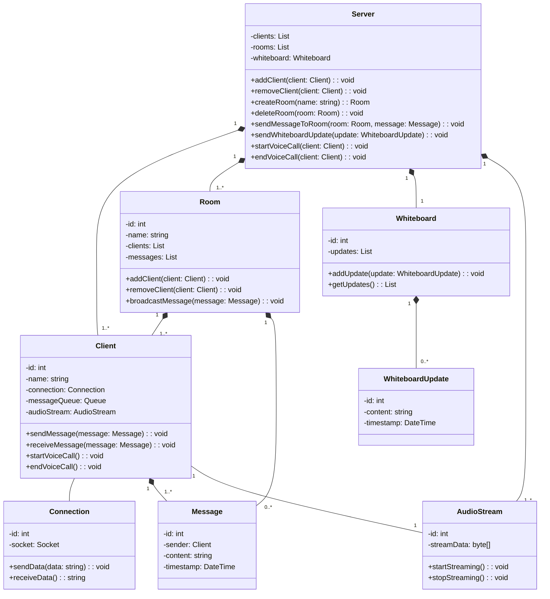
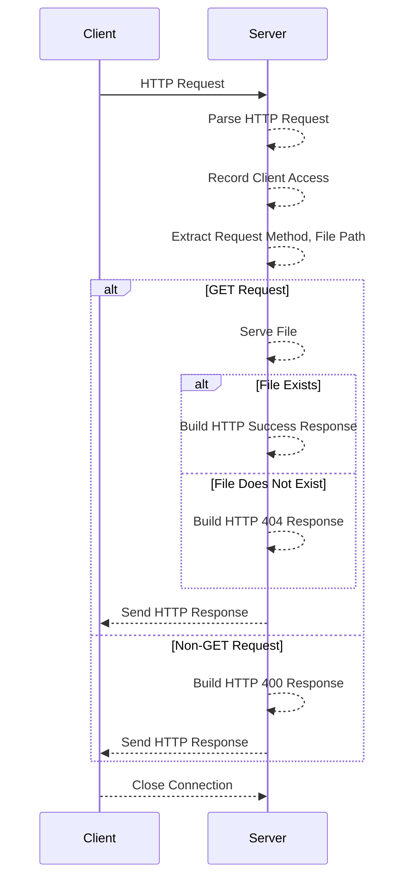
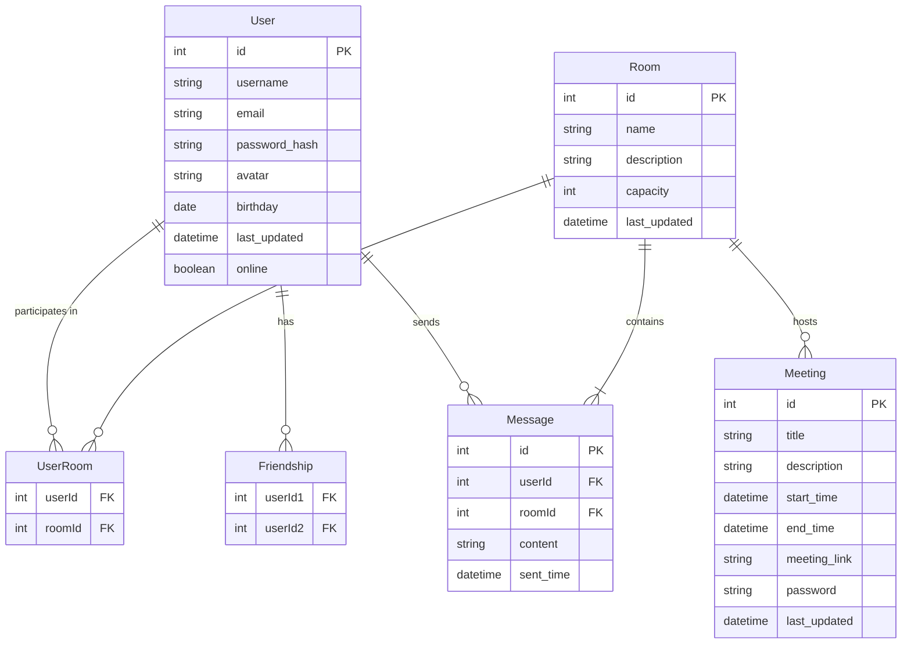
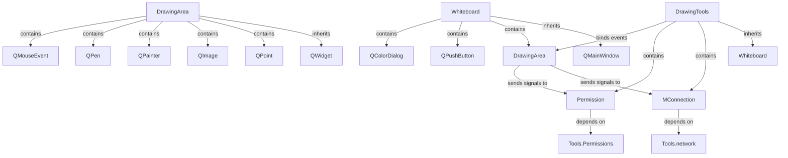
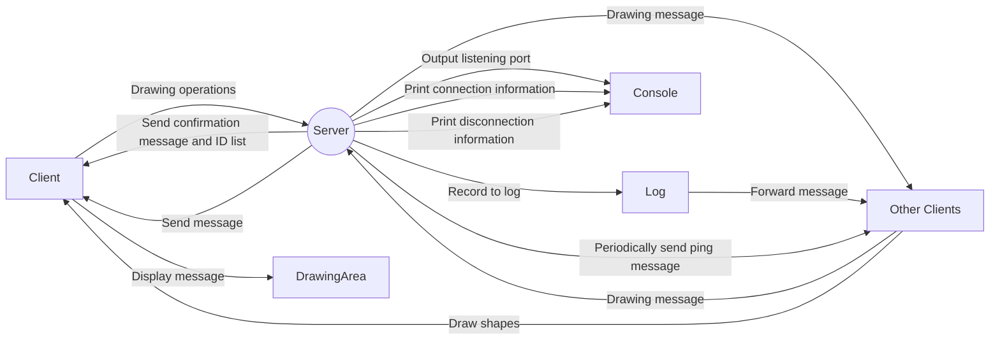
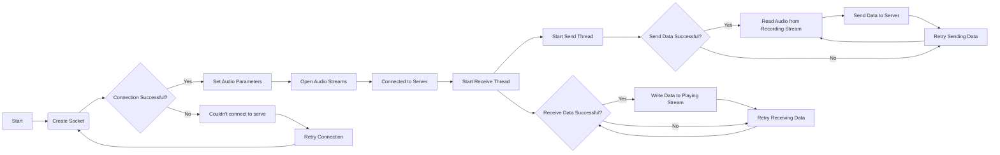

# Network Programming “MUST Meeting-Application”Report 

**Group Member**: **SILAN HU | YI REN | HAOTONG SHI**

**Finnish Time: 22/12/2023**

[TOC]

## 0. Abstract

This report describes the project we developed based on what we learned about web programming, which outlines the use of web programming in creating multifaceted web applications, **including chat,  white-boarding, and voice calling capabilities.** The impetus behind this idea stems from the growing demand for efficient and versatile integrated communication tools. 

We dared to envision and create a communication tool that pushes the boundaries of TCP and UDP technologies, drawing inspiration from and aspiring to surpass platforms like WeChat and QQ. This report is not just a collection of technical achievements; it's a saga of innovation, perseverance, and the sheer wonder of transforming complex concepts into tangible, user-centric solutions.

### 0.1 Practical exploration beyond the classroom
During the actual development process, we deeply realized the core position of text transmission in modern network applications. Based on this principle, we successfully implemented all key functions of the project. We don't just stay at the theoretical level, but continue to explore and make breakthroughs through practice.

### 0.2 Technology implementation and innovation
From the construction of the server to the modular implementation of functions, we used Python and C language to build the application infrastructure. In addition, in order to improve the user experience, we developed an attractive user interface using the PyQt5 framework. Our UI design is not limited to basic functions, but also includes special functions such as theme switching and log archiving. Innovations in these details reflect the practicality and aesthetics of our projects.


## 2. Project Overview && Direction && Challenges




## 3. Methodology and Each Stage——The Core Idea: Text Transmission as the Keystone

> At the heart of our project lies a simple yet profound realization: <mark>**text transmission is everything.** </mark>


- **Building the Web Server:** In order to solve the problem of message forwarding in the WAN, we chose to conduct a small experiment first. We wrote a Web server in C language and implemented a basic Web server function that can handle client connection requests, parse HTTP requests, and provide File service records client access information, and uses multi-threading and mutex locks to ensure thread safety.
- **Use Socket-IO realease Multi-Person Chat**


This realization became our guiding star, leading us through the complexities of network programming. We discovered that whether it's a whiteboard application or voice transmission, the key lies in converting information into text-like formats, making it the universal language of our application.（We have fully implemented a Web server, the interface design of the MUST Meeting Room program, the multi-person chat room and whiteboard functions.）

### 3.1 Stage 1: Building the Web Server

> - **Challenge:** Establishing a robust server capable of handling multiple client requests simultaneously.
> - **Breakthrough:** Utilizing text protocols for efficient data handling, ensuring seamless communication between server and clients.

#### 3.1.1 text transmission is everything: WEB-Pages is a kind of text transmission


#### 3.1.2 Review of HTTP SEVER and Socket progress

> Following sequence diagram shows the process of processing http requests between the server and the client after going through a three-way handshake to establish a TCP connection:




#### 3.1.3 Our Key Steps with Codes

- **Accept the request** - After the Client sends the request, the Server uses the 'read' function to read the HTTP request content from the client's socket. This step reads the request content into a buffer in the server's memory.

```c
char request[2048];
read(clnt_sock, request, sizeof(request)-1);
```

- **Parse the request header** - We use the `get_header_field` function to parse the HTTP request header and extract key information, such as request method, request path, Host field, etc. In the code, we mainly extract the Host and User-Agent fields.

```c
char* host = get_header_field(request,"Host");
char* user_agent = get_header_field(request,"User-Agent");
```

- **Record client access information** - We use the `record_client_access` function to record client access information, including client IP address, visited Host, User-Agent information, etc. This information can be used for purposes such as statistics on visits.

```c
record_client_access(cint_ip, host?host:"Unknown", user_agent?user_agent:"Unknown");
```

- **Handle request method** - We use the `strtok` function to parse the request method and request path in the HTTP request. Next, determine whether it is a GET request. If it is a GET request, call the `serve_file` function. If not, a response will be returned. `HTTP/1.1 400 BAD REQUEST` represents the HTTP version, status code and text description. `text/html` represents the response body is text in HTML format. `Connection: close` represents that the connection will be in Closed after the request/response is completed. Finally, the length of the message body, telling the receiver how many bytes of data should be received.

  ```c
  char *method = strtok(request," ");
  char *filepath = strtok(NULL,"");
  
  if (method && filepath && strcmp(method,"GET") == 0)
      serve_file(clnt_sock,filepath);
  else {
  	char response[] = "HTTP/1.1 400 BAD REQUEST\r\n"
          			  "Content-Type: text/html\r\n"
          			  "Connection: close r\n"
          			  "Content-Length: 11\r\n\r\n”
          			  "Bad Request";
  	write(clnt_sock, response, sizeof(response) - 1);
  }
  ```

  **If the requested path is the root path ("/")**, first attempts to serve the default index file (for example, "index.html"). This approach helps improve user experience and simplifies URL processing on the client side. If the index file exists, `serve_file` is called recursively to provide the contents of the index file. If the index file does not exist, `server_directory` will be called to provide the directory listing. If it is not the root path, it will be opened using the open function. If the file does not exist, an `HTTP 404 NOT FOUND` response will be returned. If it exists, the file size information will be returned.

  

 

### 3.2 Stage 2:  Use Socket-IO releaze Multi-Person Chat



- **User:** This entity contains the user's basic information, such as username, email, password hash (for security reasons, the hash value is stored instead of the clear text password), avatar, birthday, last update time, and online status.

- **Room:** Represents a chat room, including ID, name, description, capacity and last update time.
- **Meeting:** Associated with Room, representing a meeting entity, including meeting details such as ID, title, description, start time, end time, meeting link and password, and last update time.
- **Message:** Stores messages sent by users in the room, including message ID, sender ID, room ID, message content and sending time.
- **UserRoom:** is an association table that displays the many-to-many relationship between users and rooms. A user can participate in multiple rooms, and a room can have multiple users.
- **Friendship:** Another association table that indicates a two-way relationship between users. There are two user IDs per relationship.


The relationship between entities: User and Room are related through UserRoom, which means that users can participate in multiple rooms. User and Message are connected through the "sends" relationship, which means that the user can send multiple messages. Room and Message are connected through the "contains" relationship, which means that a room can contain multiple messages. Room and Meeting are connected through the "hosts" relationship, which means that one room can host multiple meetings. Users are related through Friendship, which means that users can establish friendship relationships.

 

### 3.3 Stage 3: Whiteboard Feature Development

> - **Challenge:** Creating a real-time collaborative whiteboard without overwhelming bandwidth.
> - **Innovation:** Transmitting key points and styles instead of the entire drawing, dramatically reducing data load while maintaining functionality.

#### 3.3.1 text transmission is everything: Graphic-drawing is a kind of text transmission


#### 3.3.1.2 Image Update

**Components in the drawing application:**



`DrawingArea` This class contains multiple components and is a custom widget that provides a drawing interface and allows color selection. `Whiteboard` contains buttons and functions for selecting colors. 

`DrawingTools` is used to manage communication between drawing tools and other components. `MConnection` depends on `Tools.network`, indicating that it handles network-related tasks for transferring data between different parts of the application.




The client performs drawing operations in the drawing area, such as drawing lines, shapes, etc. Operations during the drawing process are sent to the server. The drawing messages sent by the client will be received by the server and broadcast to all other clients to achieve drawing synchronization among multiple users. After the server receives the drawing message, it logs it and forwards the message to all other clients. After receiving the drawing message, the client draws on its own drawing area and maintains synchronization with the drawings of other clients.

 

### 3.4 Stage 4: Voice Communication Realisation

> - **Challenge:** Implementing a reliable and efficient online voice communication system.
> - **Solution:** Converting voice signals into binary sequences, allowing us to transmit voice as a series of text-based messages.

#### 


**Flowing flowchart describes our design of the process of audio streaming communication between a client and a server:**



- **Create a socket**: The client attempts to create a network socket, which is the basis for network communication.

- **Check whether the connection is successful:**

  -  If the connection is successful, the process continues to set the audio parameters.
  - If the connection is unsuccessful, the message "Couldn't connect to server" is output, and then the connection is retried.

- **Open the audio stream:** Once the connection is successful and the audio parameters are set, the client will try to open the audio stream.

- **Start the sending and receiving threads:**

  - Sending thread: Responsible for reading audio data from the recording stream and sending it to the server.

  - If the data is sent successfully, continue to send data in a loop.

  - If sending data fails, try to resend the data.

- **Receiving thread: Responsible for receiving data from the server and writing it to the playback stream.**

  - If the data is received successfully, continue to receive data in a loop.

  - If receiving data fails, try to receive data again.


## 4. Project File

**You can get exposure to whole project base on the link of my git-hub repository:**

> https://github.com/Qingbolan/MUSTmeetingSocke


## 5. Future Work

Our project aims to expand its scope by improving advanced features such as voice and video calling capabilities. The focus will be on enhancing the real-time communication efficiency of applications and ensuring low latency and high-quality audio and video transmission.


 This will involve more complex network protocols and technologies, and it will also require adding relevant packages and technologies that can transmit images to the server, such as opencv. This is also a test for us. 


We have tried to write an intermediate server that can transmit videos before, but there was no Successfully, the server can receive the information, but cannot forward it to other clients, so further knowledge is needed. Additionally, we plan to prioritize user experience by optimising interface design, adding a user database, and ensuring strong data protection security measures. These enhancements will significantly increase the utility of the application.

## 6. Reference

