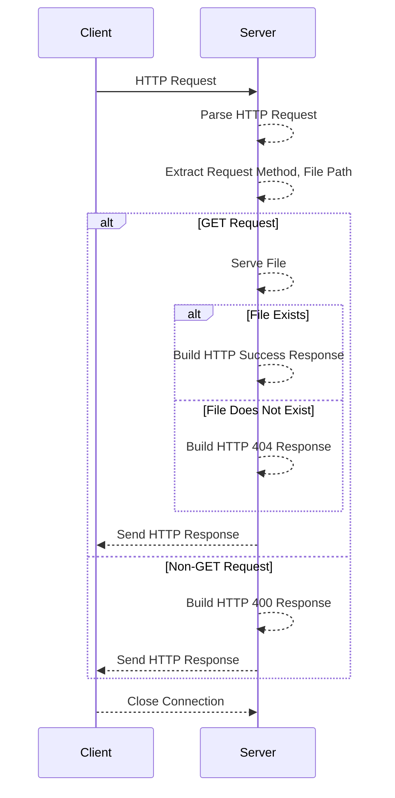

# MUSTmeetingSocket网络编程
##### 4

在网络编程的课程中，我们深入学习了 Socket 编程，掌握了使用 TCP 协议建立可靠连接以及使用 UDP 协议实现轻量级通信的技术。这为我们选择合适的通信方式提供了坚实基础。在多进程和多线程的知识支持下，我们能够实现一个服务器同时处理多个客户端的消息交互，这在实际应用中是极为重要的。思考着如何将这些知识应用到实际项目中，我们萌发了开发一个综合性应用的想法，类似于微信或腾讯会议，涵盖聊天、语音通话、白板等功能。

##### 5

然而，随着项目的深入，我们面临了一系列技术挑战。第一，在局域网内，使用内部 IP 地址进行通信非常便捷，但一旦考虑将应用扩展到广域网，涉及到了 socket 路由的问题，尤其是 NAT 穿越的挑战。NAT 将内部网络的私有 IP 地址映射为公共 IP 地址，因此我们需要一种方式来穿越这种映射，确保客户端和服务器在广域网上能够正确地通信。连接管理方面，由于UDP是无连接的协议，需要自己实现连接管理机制。这涉及到跟踪客户端的在线状态、处理加入和离开聊天室的操作，以及确保消息传递到正确的接收者。因为UDP协议不保证数据包的可靠性，因此在聊天室应用中，需要处理数据包丢失和乱序的情况。多人聊天室通常需要支持消息的广播和组播功能，以便将消息传递给所有在线用户或特定的用户组。就需要了解如何使用UDP协议实现广播和组播功能。多线程编程：使用多线程来处理多个客户端的同时连接是常见的做法。您需要掌握多线程编程的知识，包括线程创建和销毁、线程同步和互斥、线程池等概念和技术，以确保并发访问的正确性和效率。

##### 6

接下来是第二部分，Project component analysis，这一部分包括了我们逐步实现的项目内容

##### 7

为了解决消息在广域网中转发的问题，我们选择了先进行一个小实验，我们使用C语言编写了一个Web服务器，实现了一个基本的Web服务器功能，能够处理客户端的连接请求，解析HTTP请求，提供文件服务，记录客户端访问信息，并且使用了多线程和互斥锁来保证线程安全。

sequence diagram展示了这个服务器处理http请求的过程，首先看到，client发送请求后，server使用`read`函数从客户端的套接字中读取HTTP请求内容，接着调用`get_header_field`函数获取请求头中的Host和User-Agent字段，通过这个函数记录客户端的IP地址、Host、User-Agent等信息。使用`strtok`函数解析HTTP请求中的请求方法和请求路径。接下来判断是否为GET请求，如果是GET请求，调用serve_file函数。从这段代码可以看到：

- 如果请求的路径是根路径 ("/")，首先尝试服务默认的索引文件（例如，"index.html"）。
- 如果索引文件存在，则递归调用 `serve_file` 来提供索引文件的内容。
- 如果索引文件不存在，将提供目录列表。

如果文件不存在就返回一个HTTP 404 NOT FOUND的响应，存在的话就返回文件的大小的信息。可以看到不是GET请求的话就返回一个错误响应，如”400 BAD REQUEST"，并且在请求/响应结束以后断开连接。

##### 过渡：

有了创建Web Server的基础，我们又有了新的想法，实现多人聊天的功能

##### 8

这就是MUST-Meeting软件的一些界面，可以看到登陆界面、用户界面，其中包含了一些个人信息还有会议信息，同时，我们也实现了设置界面，例如可以更改主题的外观、颜色等。


### HTTP请求过程

处理客户端的HTTP请求是指服务器接收到客户端发来的HTTP请求后，进行解析并根据请求的内容执行相应的操作。在你提供的C语言服务器代码中，HTTP请求处理的主要步骤包括：

1. **接收请求：**
   - 使用`read`函数从客户端的套接字中读取HTTP请求内容。这一步骤将请求内容读取到服务器内存中的缓冲区中。

```c
char request[2048];
read(clnt_sock, request, sizeof(request) - 1);
```

2. **解析请求头：**
   - 使用`get_header_field`函数解析HTTP请求头，提取出关键信息，如请求方法、请求路径、Host字段等。在你的代码中，主要提取了Host和User-Agent字段。

```c
char* host = get_header_field(request, "Host");
char* user_agent = get_header_field(request, "User-Agent");
```

3. **记录客户端访问信息：**
   - 使用`record_client_access`函数记录客户端的访问信息，包括客户端IP地址、访问的Host、User-Agent信息等。这些信息可用于统计访问量等用途。

```c
record_client_access(clnt_ip, host ? host : "Unknown", user_agent ? user_agent : "Unknown");
```

4. **处理请求方法：**
   - 通过解析得到的请求方法（在你的代码中是GET），执行相应的操作。在你的代码中，主要处理了GET请求。

```c
char *method = strtok(request, " ");
char *filepath = strtok(NULL, " ");

if (method && filepath && strcmp(method, "GET") == 0) {
    serve_file(clnt_sock, filepath);
} else {
    // 处理非GET请求的逻辑，返回400 Bad Request
    // ...
}
```

5. **提供文件服务或错误响应：**
   - 如果是GET请求，使用`serve_file`函数提供文件服务。如果是其他请求，可以返回适当的错误响应，如400 Bad Request等。

```c
void serve_file(int sock, char *filepath) {
    // 处理文件服务逻辑，包括打开文件、读取文件内容、发送响应等
    // ...
}
```

总的来说，处理客户端的HTTP请求就是根据请求的内容，执行相应的逻辑。在Web服务器中，这通常包括提供静态文件服务、处理动态请求、记录访问日志等功能。




### Strtoke函数

在这段代码中，`strtok` 函数用于将字符串 `request` 按照空格分割成多个部分。第一次调用 `strtok` 时，传递的参数是 `request`，用空格作为分隔符。`strtok` 返回的是分割后的第一个部分的指针，这个部分是 HTTP 请求中的方法，比如 "GET" 或 "POST"。

第二次调用 `strtok` 时，传递的参数是 `NULL`。在这里，`strtok` 会继续从上一次调用结束的位置继续分割字符串。因为第一次调用时已经将字符串分割成了两部分，第二次调用时传递 `NULL` 表示继续分割之前的字符串。`strtok` 返回的是分割后的第二部分的指针，这个部分是 HTTP 请求中的路径（即文件路径）。

这种用法允许我们在不使用额外的变量的情况下，依次获取 HTTP 请求中的不同部分。


### 只处理GET请求

在这个简单的网络服务器实现中，只对GET请求进行了处理，而对其他HTTP请求方法（比如POST、PUT等）没有相应的处理逻辑。这是因为这个服务器的目的是提供静态文件服务，而GET请求通常用于请求指定资源（如文件）。

在HTTP中，不同的请求方法有不同的语义和用途。GET请求通常用于获取资源，而POST请求通常用于提交数据。对于这个简单的文件服务器，只处理GET请求是合理的，因为它主要用于提供文件下载服务。

如果收到了不支持的HTTP请求方法，服务器会返回一个"400 BAD REQUEST"响应，表示请求无效。这样的设计是为了明确告诉客户端服务器只支持GET请求，其他请求方法将被视为无效。在实际的应用中，服务器可以根据需求扩展以支持其他类型的请求方法，比如处理用户提交的数据等。

总之，这种设计是基于服务器用途和功能的考虑。在构建实际的应用时，需要根据应用的需求来决定支持哪些HTTP请求方法。


### HTTP响应具体内容

在 HTTP 协议中，HTTP 响应的状态码用于表示服务器对请求的处理结果。状态码是一个三位的数字，由服务器返回给客户端。每个状态码都有特定的含义。

在这里，`HTTP/1.1 404 NOT FOUND` 表示 HTTP 响应的状态行，其中：

- `HTTP/1.1` 表示使用的是 HTTP 1.1 版本。
- `404` 是状态码，表示 "Not Found"，即未找到请求的资源。
- `NOT FOUND` 是状态码的文本描述。

这个响应告诉客户端请求的资源在服务器上未找到。这通常是因为客户端请求了一个不存在的文件或路径。

在上述代码中，服务器通过 `write` 函数将这个 HTTP 响应发送给客户端，告知客户端请求的资源未找到。

#### Content-type

`Content-Type` 是 HTTP 响应头的一部分，用于指示实际响应体中的数据类型。它告诉客户端如何解析响应的数据。`Content-Type` 的值通常是标准的 MIME 类型（Multipurpose Internet Mail Extensions）。

一些常见的 `Content-Type` 值包括：

- `text/html`: 表示响应体是 HTML 格式的文本。
- `text/plain`: 表示响应体是纯文本。
- `application/json`: 表示响应体是 JSON 格式的数据。
- `image/jpeg`: 表示响应体是 JPEG 图像。
- `audio/mpeg`: 表示响应体是 MP3 音频文件。

在 HTTP 响应中，`Content-Type` 的设置有助于客户端正确解释服务器返回的内容。例如，如果 `Content-Type` 是 `text/html`，客户端会将响应体解析为 HTML 文档进行显示。

#### Connection

`Connection` 是 HTTP 报文头部的一部分，用于指定是否在请求完成后保持与服务器的连接，或者在响应完成后保持与客户端的连接。它可以包含以下值之一：

- `keep-alive`: 表示客户端或服务器希望保持连接打开，以便在同一连接上进行多个请求/响应。
- `close`: 表示客户端或服务器希望在请求/响应完成后关闭连接。

当 `Connection: keep-alive` 被设置时，连接将被保持打开，允许在同一连接上进行多个请求和响应，而不必为每个请求/响应重新建立连接。这有助于减少延迟和提高性能。

当 `Connection: close` 被设置时，连接将在请求/响应完成后关闭。这意味着每个请求都需要建立一个新的连接。

默认情况下，HTTP/1.1 版本的连接是持久连接，除非特别指定 `Connection: close`。在 HTTP/1.0 中，默认情况是非持久连接，需要显式指定 `Connection: keep-alive` 以启用持久连接。

#### Content-length

`Content-Length` 是 HTTP 报文头部字段之一，用于指示报文主体（body）的长度，以字节为单位。它告诉接收方应该接收多少字节的数据，从而能够正确地读取整个报文主体。


