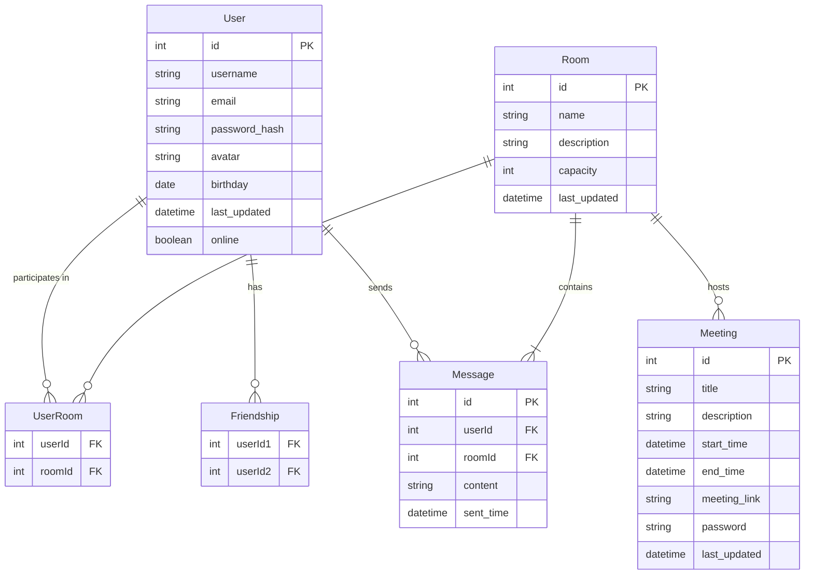

# MUST Meeting for Enterprise (Server)开发文档

> **Author: SILAN HU, 2023-11-26**

## 1. 项目概述

本项目是在线会议室服务端开发内容。

## 2. 技术栈

- **前端**：PyQt(Python)
- **后端**：Flask (Python)
- **通信**：Flask.socketIO
- **数据库**：SQLAlchemy (SQLite)
- **实时通信**：Flask-SocketIO
- **API**：RESTful API

## 3. 数据库设计

我们分服务端和客户端分别考虑到了，实时消息交流，会议室创建和管理，用户状态跟踪（在线/离线），数据同步等场景

### 3.1 服务端实体关系图（SERD）



## 目前的代码框架如下

### project structure

```
project/
    |- app/
    |   |- __init__.py
    |   |- database.py
    |   |- models.py
    |   |- routes
    |   	|- auth.py
    |   	|- chat.py
    |   	|- user.py
    |
    |- static/
    |
    |- Server.db
    |- main.py
```

#### app/__**init**.py__

```python
from flask import Flask
from flask_sqlalchemy import SQLAlchemy
from flask_login import LoginManager
from flask_jwt_extended import JWTManager
from flask_socketio import SocketIO
import os

db = SQLAlchemy()
socketio = SocketIO()
login_manager = LoginManager()
jwt = JWTManager()


def init_app(app):
    basedir = os.path.abspath(os.path.dirname(os.path.dirname(__file__)))
    app.config['SECRET_KEY'] = 'secret_key_here'
    app.config['SQLALCHEMY_DATABASE_URI'] = 'sqlite:///' + os.path.join(basedir, 'Server.db')
    app.config['SQLALCHEMY_TRACK_MODIFICATIONS'] = False
    app.config['JWT_SECRET_KEY'] = 'jwt_secret_key_here'  # JWT 密钥
  
  
    db.init_app(app)
    login_manager.init_app(app)
    jwt.init_app(app)
    socketio.init_app(app)
  
    with app.app_context():
        db.create_all()


def create_app(app):  
    from .routes.chat import chat_bp
    from .routes.auth import auth_bp
    app.register_blueprint(chat_bp)
    app.register_blueprint(auth_bp)
    init_app(app)
    return app

```

#### app/database.py

```python
from flask_sqlalchemy import SQLAlchemy
from logging.config import dictConfig

# Log configuration
dictConfig({
    'version': 1,
    'formatters': {'default': {
        'format': '[%(asctime)s] %(levelname)s in %(module)s: %(message)s',
    }},
    'handlers': {'wsgi': {
        'class': 'logging.StreamHandler',
        'stream': 'ext://flask.logging.wsgi_errors_stream',
        'formatter': 'default'
    }},
    'root': {
        'level': 'INFO',
        'handlers': ['wsgi']
    }
})

db = SQLAlchemy()
```

#### app/models.py

```python
from .database import db

from sqlalchemy import Column, DateTime, String, Integer, ForeignKey, Boolean
from sqlalchemy.orm import relationship
from werkzeug.security import generate_password_hash, check_password_hash
from flask_login import UserMixin


class User(db.Model, UserMixin):
    __tablename__ = 'users'
  
    id = Column(Integer, primary_key=True)
    username = Column(String)
    email = Column(String)
    password_hash = Column(String)
    avatar = Column(String)
    birthday = Column(DateTime)
    last_updated = Column(DateTime)
    online = Column(Boolean, default=False)  # 新增字段，表示用户在线状态

    messages = relationship("Message", back_populates="user")
    user_rooms = relationship("UserRoom", back_populates="user")
    friendships = relationship("Friendship", back_populates="user")

    def set_password(self, password):
        self.password_hash = generate_password_hash(password)

    def check_password(self, password):
        return check_password_hash(self.password_hash, password)

class Room(db.Model):
    __tablename__ = 'rooms'
  
    id = Column(Integer, primary_key=True)
    name = Column(String)
    description = Column(String)
    capacity = Column(Integer)
    last_updated = Column(DateTime)

    meetings = relationship("Meeting", back_populates="room")
    messages = relationship("Message", back_populates="room")
    user_rooms = relationship("UserRoom", back_populates="room")

class UserRoom(db.Model):
    __tablename__ = 'user_rooms'
  
    user_id = Column(Integer, ForeignKey('users.id'), primary_key=True)
    room_id = Column(Integer, ForeignKey('rooms.id'), primary_key=True)

    user = relationship("User", back_populates="user_rooms")
    room = relationship("Room", back_populates="user_rooms")

class Friendship(db.Model):
    __tablename__ = 'friendships'
  
    user_id1 = Column(Integer, ForeignKey('users.id'), primary_key=True)
    user_id2 = Column(Integer)

    user = relationship("User", back_populates="friendships")

class Meeting(db.Model):
    __tablename__ = 'meetings'
  
    id = Column(Integer, primary_key=True)
    title = Column(String)
    description = Column(String)
    start_time = Column(DateTime)
    end_time = Column(DateTime)
    meeting_link = Column(String)
    password = Column(String)
    last_updated = Column(DateTime)

    room_id = Column(Integer, ForeignKey('rooms.id'))
    room = relationship("Room", back_populates="meetings")

class Message(db.Model):
    __tablename__ = 'messages'
  
    id = Column(Integer, primary_key=True)
    content = Column(String)
    sent_time = Column(DateTime)

    user_id = Column(Integer, ForeignKey('users.id'))
    room_id = Column(Integer, ForeignKey('rooms.id'))

    user = relationship("User", back_populates="messages")
    room = relationship("Room", back_populates="messages")

```

### app/routes/auth.py

```python
from flask import Blueprint, request, jsonify
from flask_login import login_user, logout_user, current_user
from flask_jwt_extended import create_access_token
from werkzeug.security import check_password_hash
from ..models import User, db
from .. import login_manager

auth_bp = Blueprint('auth', __name__, url_prefix='/auth')

@login_manager.user_loader
def load_user(user_id):
    return User.query.get(int(user_id))

@auth_bp.route('/login', methods=['POST'])
def login():
    data = request.get_json()
    user = User.query.filter_by(username=data.get('username')).first()
    if user and check_password_hash(user.password_hash, data.get('password')):
        login_user(user)
        access_token = create_access_token(identity=user.id)
        return jsonify(access_token=access_token)
    return jsonify({"msg": "Bad username or password"}), 401

@auth_bp.route('/logout', methods=['POST'])
def logout():
    logout_user()
    return jsonify({"msg": "Successfully logged out"}), 200


@auth_bp.route('/register', methods=['POST'])
def register():
    data = request.get_json()
    username = data.get('username')
    email = data.get('email')
    password = data.get('password')

    if User.query.filter_by(username=username).first():
        return jsonify({'message': 'Username already exists'}), 409

    new_user = User(username=username, email=email)
    new_user.set_password(password)
    db.session.add(new_user)
    db.session.commit()

    return jsonify({'message': 'User created successfully'}), 201

```

### app/routes/user.py

```python
from flask import Blueprint, jsonify
from ..models import User

user_bp = Blueprint('user', __name__, url_prefix='/user')

@user_bp.route('/search/<username>', methods=['GET'])
def search_user(username):
    users = User.query.filter(User.username.ilike(f'%{username}%')).all()
    users_data = [{'id': user.id, 'username': user.username} for user in users]
    return jsonify(users_data)
```

### app/routes/chat.py

```python
from flask import Blueprint
from flask_socketio import emit, join_room, leave_room
from .. import socketio
from flask_jwt_extended import jwt_required, get_jwt_identity


chat_bp = Blueprint('chat', __name__, url_prefix='/chat')

@socketio.on('join_room', namespace='/chat')
@jwt_required()
def handle_join_room(data):
    current_user_id = get_jwt_identity()
    join_room(data['room'])
    emit('room_announcement', {'message': f"{data['username']} has joined the room."}, room=data['room'])

@socketio.on('leave_room', namespace='/chat')
def handle_leave_room(data):
    leave_room(data['room'])
    emit('room_announcement', {'message': f"{data['username']} has left the room."}, room=data['room'])

@socketio.on('chat_message', namespace='/chat')
def handle_chat_message(data):
    emit('receive_message', {'message': data['message']}, room=data['room'])

```

### main.py

```
from flask import Flask
from app import create_app

app = Flask(__name__, static_folder='static', static_url_path='/static', template_folder='templates')
app = create_app(app) 

app.run(debug=True, host='0.0.0.0', port=7100)  # Run the app
```
