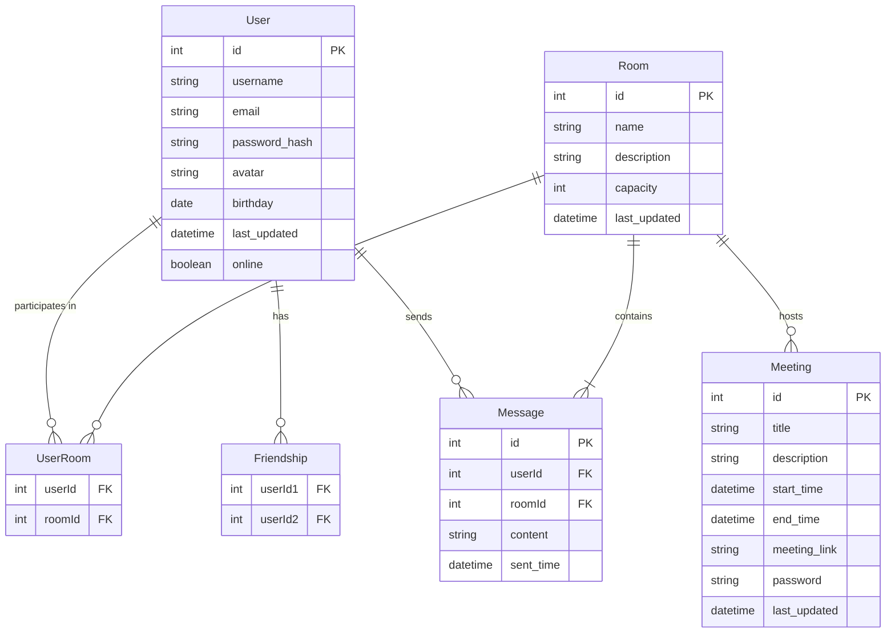

## 数据库设计说明文档

### 概述

我们的数据库设计主要为在线会议室的数据客户端与服务端日常使用设计的。它考虑到了用户端与客户端日常使用的场景与日常更新和交流。

### 服务端实体关系图（SERD）

```mermaid
erDiagram
    User ||--o{ UserRoom : "participates in"
    User ||--o{ Friendship : "has"
    User ||--o{ Message : "sends"
    User {
        int id PK
        string username
        string email
        string password_hash
        string avatar
        date birthday
        datetime last_updated
        boolean online
    }

    Room ||--o{ UserRoom : "includes"
    Room ||--o{ Meeting : "hosts"
    Room ||--|{ Message : "contains"
    Room {
        int id PK
        string name
        string description
        int capacity
        datetime last_updated
    }

    UserRoom {
        int userId FK
        int roomId FK
    }

    Friendship {
        int userId1 FK
        int userId2 FK
    }

    Meeting {
        int id PK
        string title
        string description
        datetime start_time
        datetime end_time
        string meeting_link
        string password
        datetime last_updated
    }

    Message {
        int id PK
        int userId FK
        int roomId FK
        string content
        datetime sent_time
    }

```

### 客户端实体关系图（CERD）

```mermaid
erDiagram
    User ||--o{ UserRoom : "participates in"
    User ||--o{ Friendship : "has"
    User ||--o{ Message : "sends"
    User {
        int id PK
        string username
        string email
        string password_hash
        string avatar
        date birthday
        datetime last_updated
        boolean online
    }

    Room ||--o{ UserRoom : "includes"
    Room ||--o{ Meeting : "hosts"
    Room ||--|{ Message : "contains"
    Room {
        int id PK
        string name
        string description
        int capacity
        datetime last_updated
    }

    UserRoom {
        int userId FK
        int roomId FK
    }

    Friendship {
        int userId1 FK
        int userId2 FK
    }

    Meeting {
        int id PK
        string title
        string description
        datetime start_time
        datetime end_time
        string meeting_link
        string password
        datetime last_updated
    }

    Message {
        int id PK
        int userId FK
        int roomId FK
        string content
        datetime sent_time
    }

```

